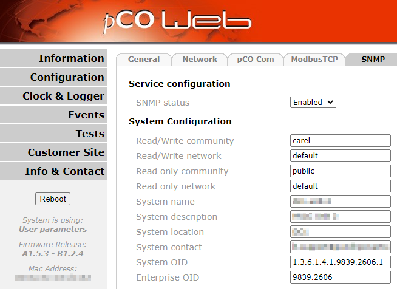

# Carel pCOWeb mibs

The [Carel pCOWeb card](https://www.carel.com/bms-building-management-system-na/-/journal_content/56_INSTANCE_i4q5KIMLInKK/10191/55239) is a device that allows you to connect datacenter HVAC devices to your network and poll them via SNMP. 

The he pCOWeb card is vendor agnostic. When viewing the oid tree all values are provided under vendor id 9839 (Carel). This can be modified to be replaced with another vendor id if a MIB is available.

Rittal however has not provided a MIB for their [LCP DX product family](https://www.rittal.com/de-de/products/PG0800ITINFRA1/PGR1951ITINFRA1/PG1023ITINFRA1/PRO34169?variantId=3311410). This is problematic when trying to read/monitor values. 

In order to remedy this I have written a MIB using the [installation documentation provided by Rittal](https://www.rittal.com/imf/none/3_4342/3311320_Instructions_spec__EN).

Almost all values are included except for some date values. Where neccesary a `TEXTUAL-CONVENTION` has been used in the mib to convert the numbers to proper values. Entries also have the correct `UNITS` where possible. [RFC 1443](https://datatracker.ietf.org/doc/html/rfc1443) and [RFC 2578](https://datatracker.ietf.org/doc/html/rfc2578) were used.

## Configuring the pCOWeb card

Log on to the configuration page of the pCOWeb card. This is not always the ip address but rather a subdirectory. If you cant directly reach the configuration page try `<ip address>/config`. The default username and password is `admin/fadmin`. Modern browsers require you to enter this 2 or 3 times.

Afterwards you need to open the `configuration -> snmp page`. There you will see the following page:



Use the following values:

System OID | Enterprise OID
- | -
1.3.6.1.4.1.9839.2606.1 | 9839.2606

## Using this mib

First of all you can use your favourite mib viewer/browser. Make sure that it includes the following MIBs: *SNMPv2-SMI, SNMPv2-CONF, SNMPv2-TC*. If they are not included you'll have to download them yourself and place them in the appropriate directory of your software.

The second option is when using the linux cli. Just install the snmp and snmp-mibs downloader package:

```
sudo apt install snmp snmp-mibs-downloader
```

This will install the base snmp mibs and tools + all extra mibs needed.

When this is done you can use the mib to poll your device (replace the values where neccesary).:

```
snmpget -v 2c -c <community string> -m ./mibs/CAREL-RITTAL-LCP-3311-MIB.mib <ip address/hostname> .1.3.6.1.4.1.9839.2606.2.1.2.21.0

# Append a zero to the sensor name
snmpget -v 2c -c <community string> -m ./mibs/CAREL-RITTAL-LCP-3311-MIB.mib <ip address/hostname> inputTemperatureAverage.0
```

Both of these commands will return the properly formatted value:

```
CAREL-RITTAL-LCP-3311-MIB::inputTemperatureAverage.0 = INTEGER: 31.3 C
```

## Implemented sensors

| Entry                                    	| Type    	| R/W        	| OID                              	| Unit  	| Description                                                                                                                                                                                                                                         	|
|------------------------------------------	|---------	|------------	|----------------------------------	|-------	|-----------------------------------------------------------------------------------------------------------------------------------------------------------------------------------------------------------------------------------------------------	|
| compressorOverloadAlarm                  	| digital 	| read-only  	| .1.3.6.1.4.1.9839.2606.2.1.1.2   	|       	| Compressor overload alarm: ok (0), alarm (1)                                                                                                                                                                                                        	|
| highPressureAlarm                        	| digital 	| read-only  	| .1.3.6.1.4.1.9839.2606.2.1.1.3   	|       	| High pressure alarm: ok (0), alarm (1)                                                                                                                                                                                                              	|
| remoteOnOff                              	| digital 	| read-only  	| .1.3.6.1.4.1.9839.2606.2.1.1.8   	|       	| Inverter alarm: ok (0), alarm (1)                                                                                                                                                                                                                   	|
| inverterAlarm                            	| digital 	| read-only  	| .1.3.6.1.4.1.9839.2606.2.1.1.11  	|       	| General alarm: ok (0), alarm (1)                                                                                                                                                                                                                    	|
| driveAlarm                               	| digital 	| read-only  	| .1.3.6.1.4.1.9839.2606.2.1.1.12  	|       	| Reset all alarms: no (0), yes (1)                                                                                                                                                                                                                   	|
| inverterOnOff                            	| digital 	| read-only  	| .1.3.6.1.4.1.9839.2606.2.1.1.17  	|       	| Compressor forced off working out envelope: ok (0), alarm (1)                                                                                                                                                                                       	|
| generalAlarm                             	| digital 	| read-only  	| .1.3.6.1.4.1.9839.2606.2.1.1.23  	|       	| Compressor startup failure alarm, reached max retries: ok (0), alarm (1)                                                                                                                                                                            	|
| resetAllAlarms                           	| digital 	| read-write 	| .1.3.6.1.4.1.9839.2606.2.1.1.29  	|       	| Maximum discharge temperature has been reached: ok (0), alarm (1)                                                                                                                                                                                   	|
| compressorEnvelopeAlarm                  	| digital 	| read-only  	| .1.3.6.1.4.1.9839.2606.2.1.1.30  	|       	| Delta pressure too big to startup compressor: ok (0), alarm (1)                                                                                                                                                                                     	|
| compressorStartupFailureAlarm            	| digital 	| read-only  	| .1.3.6.1.4.1.9839.2606.2.1.1.31  	|       	| Top output temperature probe broken: ok (0), alarm (1)                                                                                                                                                                                              	|
| maxDischargeTemperatureAlarm             	| digital 	| read-only  	| .1.3.6.1.4.1.9839.2606.2.1.1.33  	|       	| Mid output temperature probe broken: ok (0), alarm (1)                                                                                                                                                                                              	|
| compressorDeltaPressureAlarm             	| digital 	| read-only  	| .1.3.6.1.4.1.9839.2606.2.1.1.35  	|       	| Bottom output temperature probe broken: ok (0), alarm (1)                                                                                                                                                                                           	|
| oilReturnAlarm                           	| digital 	| read-only  	| .1.3.6.1.4.1.9839.2606.2.1.1.36  	|       	| Top input temperature probe broken: ok (0), alarm (1)                                                                                                                                                                                               	|
| outputTemperatureTopProbeAlarm           	| digital 	| read-only  	| .1.3.6.1.4.1.9839.2606.2.1.1.38  	|       	| Mid input temperature probe broken: ok (0), alarm (1)                                                                                                                                                                                               	|
| outputTemperatureMidProbeAlarm           	| digital 	| read-only  	| .1.3.6.1.4.1.9839.2606.2.1.1.39  	|       	| Bottom input temperature probe broken: ok (0), alarm (1)                                                                                                                                                                                            	|
| outputTemperatureBottomProbeAlarm        	| digital 	| read-only  	| .1.3.6.1.4.1.9839.2606.2.1.1.40  	|       	| Compressor discharge temperature probe broken: ok (0), alarm (1)                                                                                                                                                                                    	|
| inputTemperatureTopProbeAlarm            	| digital 	| read-only  	| .1.3.6.1.4.1.9839.2606.2.1.1.42  	|       	| Compressor suction temperature probe broken: ok (0), alarm (1)                                                                                                                                                                                      	|
| inputTemperatureMidProbeAlarm            	| digital 	| read-only  	| .1.3.6.1.4.1.9839.2606.2.1.1.43  	|       	| Compressor discharge suction probe broken: ok (0), alarm (1)                                                                                                                                                                                        	|
| inputTemperatureBottomProbeAlarm         	| digital 	| read-only  	| .1.3.6.1.4.1.9839.2606.2.1.1.44  	|       	| Compressor suction suction probe broken: ok (0), alarm (1)                                                                                                                                                                                          	|
| compressorDischargeTemperatureProbeAlarm 	| digital 	| read-only  	| .1.3.6.1.4.1.9839.2606.2.1.1.45  	|       	| Compressor discharge temperature probe broken: ok (0), alarm (1)                                                                                                                                                                                    	|
| compressorSuctionTemperatureProbeAlarm   	| digital 	| read-only  	| .1.3.6.1.4.1.9839.2606.2.1.1.46  	|       	| Compressor suction temperature probe broken: ok (0), alarm (1)                                                                                                                                                                                      	|
| compressorDischargeSuctionProbeAlarm     	| digital 	| read-only  	| .1.3.6.1.4.1.9839.2606.2.1.1.47  	|       	| Compressor discharge suction probe broken: ok (0), alarm (1)                                                                                                                                                                                        	|
| compressorSuctionSuctionProbeAlarm       	| digital 	| read-only  	| .1.3.6.1.4.1.9839.2606.2.1.1.48  	|       	| Compressor suction suction probe broken: ok (0), alarm (1)                                                                                                                                                                                          	|
| reboot                                   	| digital 	| read-write 	| .1.3.6.1.4.1.9839.2606.2.1.1.100 	|       	| Reboot the system: no (0), yes (1)                                                                                                                                                                                                                  	|
| compressorRotorSpeedHz                   	| integer 	| read-only  	| .1.3.6.1.4.1.9839.2606.2.1.3.1   	| Hz    	| Compressor rotor speed in Hz                                                                                                                                                                                                                        	|
| driverPowerStatus                        	| integer 	| read-only  	| .1.3.6.1.4.1.9839.2606.2.1.3.2   	|       	| Driver power status stop (1), run (2), alarm (3)                                                                                                                                                                                                    	|
| currentErrorCode                         	| integer 	| read-only  	| .1.3.6.1.4.1.9839.2606.2.1.3.3   	|       	| Current error code                                                                                                                                                                                                                                  	|
| driverTemperature                        	| integer 	| read-only  	| .1.3.6.1.4.1.9839.2606.2.1.3.4   	| C     	| Driver Power+ Temperature                                                                                                                                                                                                                           	|
| dcBusVoltage                             	| integer 	| read-only  	| .1.3.6.1.4.1.9839.2606.2.1.3.5   	| V     	| Power+ DC Voltage                                                                                                                                                                                                                                   	|
| motorVoltage                             	| integer 	| read-only  	| .1.3.6.1.4.1.9839.2606.2.1.3.6   	| V     	| Motor Voltage                                                                                                                                                                                                                                       	|
| powerRequest                             	| integer 	| read-only  	| .1.3.6.1.4.1.9839.2606.2.1.3.7   	| %     	| Request of power for inverter after envelop                                                                                                                                                                                                         	|
| unitOnOff                                	| integer 	| read-write 	| .1.3.6.1.4.1.9839.2606.2.1.3.13  	|       	| Unit on/off state: off (0), on   (1), energy-save (2), auto (3)                                                                                                                                                                                     	|
| envelopeZone                             	| integer 	| read-only  	| .1.3.6.1.4.1.9839.2606.2.1.3.14  	|       	| envelope zone: ok (0), maximum compression ratio (1), maximum discharge   power (2), current limit (3), maximum suction power(4), minimum compression   ratio (5), minimum delta power (6), minimum discharge power(7), minimum   suction power (8) 	|
| coolingCapacity                          	| integer 	| read-only  	| .1.3.6.1.4.1.9839.2606.2.1.3.16  	| %     	| Actual EVD valve cooling capacity                                                                                                                                                                                                                   	|
| evdValveSteps                            	| integer 	| read-only  	| .1.3.6.1.4.1.9839.2606.2.1.3.17  	| steps 	| EVD valve steps position                                                                                                                                                                                                                            	|
| fanSpeedPercent                          	| integer 	| read-only  	| .1.3.6.1.4.1.9839.2606.2.1.3.28  	| %     	| The fan speed percentage                                                                                                                                                                                                                            	|
| fanSpeedRpm                              	| integer 	| read-only  	| .1.3.6.1.4.1.9839.2606.2.1.3.29  	| rpm   	| The fan speed rpm                                                                                                                                                                                                                                   	|
| evdValveOpening                          	| integer 	| read-only  	| .1.3.6.1.4.1.9839.2606.2.1.3.30  	| %     	| Actual EVD valve opening                                                                                                                                                                                                                            	|
| outputTemperatureTopSensor               	| analog  	| read-only  	| .1.3.6.1.4.1.9839.2606.2.1.2.2   	| C     	| Top sensor output temperature in Celcius                                                                                                                                                                                                            	|
| outputTemperatureMidSensor               	| analog  	| read-only  	| .1.3.6.1.4.1.9839.2606.2.1.2.3   	| C     	| Mid sensor output temperature in Celcius                                                                                                                                                                                                            	|
| outputTemperatureBottomSensor            	| analog  	| read-only  	| .1.3.6.1.4.1.9839.2606.2.1.2.4   	| C     	| Bottom sensor output temperature in Celcius                                                                                                                                                                                                         	|
| inputTemperatureTopSensor                	| analog  	| read-only  	| .1.3.6.1.4.1.9839.2606.2.1.2.6   	| C     	| Top sensor input temperature in Celcius                                                                                                                                                                                                             	|
| inputTemperatureMidSensor                	| analog  	| read-only  	| .1.3.6.1.4.1.9839.2606.2.1.2.7   	| C     	| Mid sensor input temperature in Celcius                                                                                                                                                                                                             	|
| inputTemperatureBottomSensor             	| analog  	| read-only  	| .1.3.6.1.4.1.9839.2606.2.1.2.8   	| C     	| Bottom sensor input temperature in Celcius                                                                                                                                                                                                          	|
| compressorDischargeTemperature           	| analog  	| read-only  	| .1.3.6.1.4.1.9839.2606.2.1.2.9   	| C     	| Compressor discharge temperature                                                                                                                                                                                                                    	|
| compressorSuctionTemperature             	| analog  	| read-only  	| .1.3.6.1.4.1.9839.2606.2.1.2.10  	| C     	| Compressor suction temperature                                                                                                                                                                                                                      	|
| compressorDischargePressure              	| analog  	| read-only  	| .1.3.6.1.4.1.9839.2606.2.1.2.11  	| bar   	| Compressor discharge pressure                                                                                                                                                                                                                       	|
| compressorSuctionPressure                	| analog  	| read-only  	| .1.3.6.1.4.1.9839.2606.2.1.2.12  	| bar   	| Compressor suction pressure                                                                                                                                                                                                                         	|
| evaporatorTemperature                    	| analog  	| read-only  	| .1.3.6.1.4.1.9839.2606.2.1.2.13  	| C     	| Evaporator temperature from Low pressure conversion                                                                                                                                                                                                 	|
| condensingTemperature                    	| analog  	| read-only  	| .1.3.6.1.4.1.9839.2606.2.1.2.14  	| C     	| Condensing temperature from High pressure conversion                                                                                                                                                                                                	|
| inputTemperatureAverage                  	| analog  	| read-only  	| .1.3.6.1.4.1.9839.2606.2.1.2.21  	| C     	| Average input temperature in Celcius                                                                                                                                                                                                                	|
| outputTemperatureAverage                 	| analog  	| read-only  	| .1.3.6.1.4.1.9839.2606.2.1.2.22  	| C     	| Average output temperature in Celcius                                                                                                                                                                                                               	|
| compressorRotorSpeed                     	| analog  	| read-only  	| .1.3.6.1.4.1.9839.2606.2.1.2.45  	| rps   	| Compressor rotor speed                                                                                                                                                                                                                              	|
| compressorMotorCurrent                   	| analog  	| read-only  	| .1.3.6.1.4.1.9839.2606.2.1.2.46  	| A     	| Compressor motor current                                                                                                                                                                                                                            	|
| lcpSetpoint                              	| analog  	| read-write 	| .1.3.6.1.4.1.9839.2606.2.1.2.48  	| C     	| Main LCP setpoint                                                                                                                                                                                                                                   	|

## Tags
* SK 3311.410-440
* SK 3311.320
* Rittal LCP DX
* Rittal Liquid Cooling Package
* Rittal Chiller